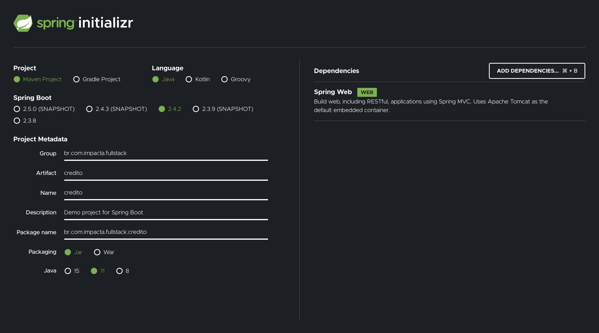
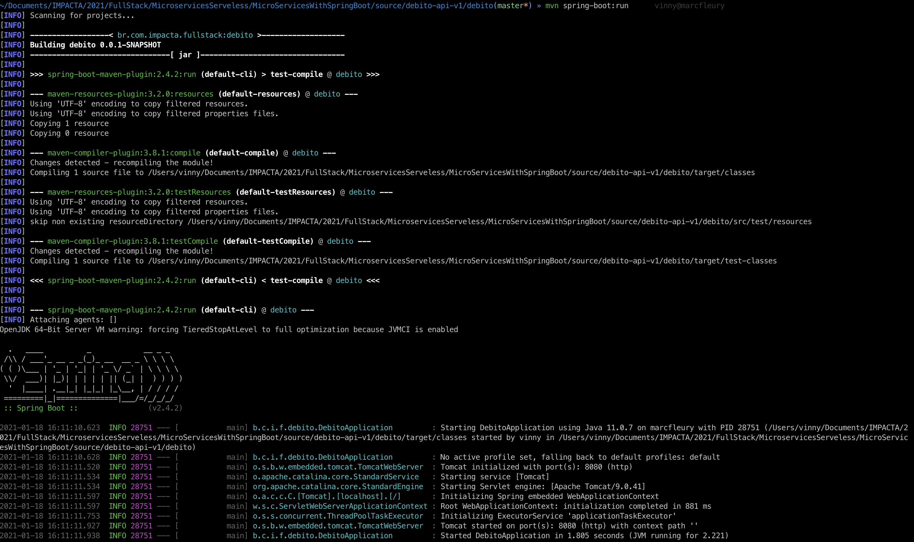
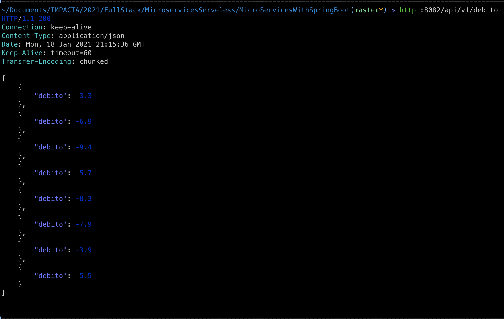
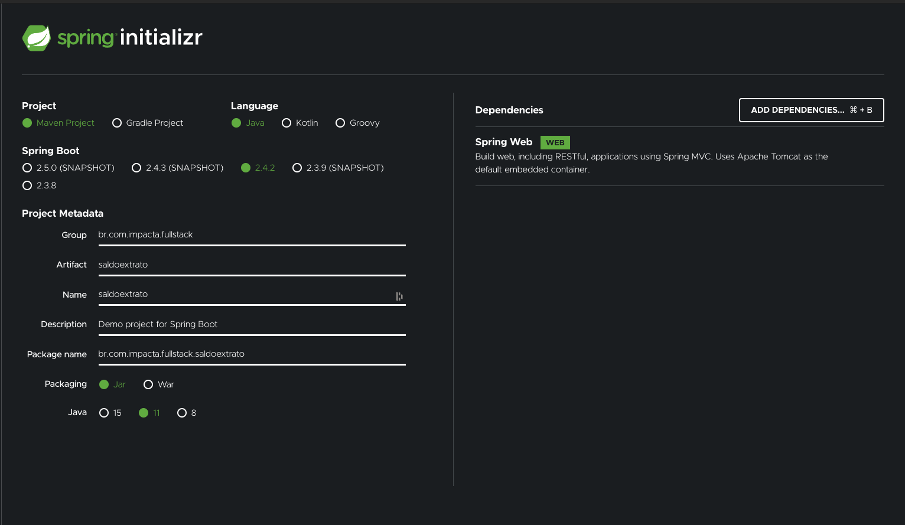
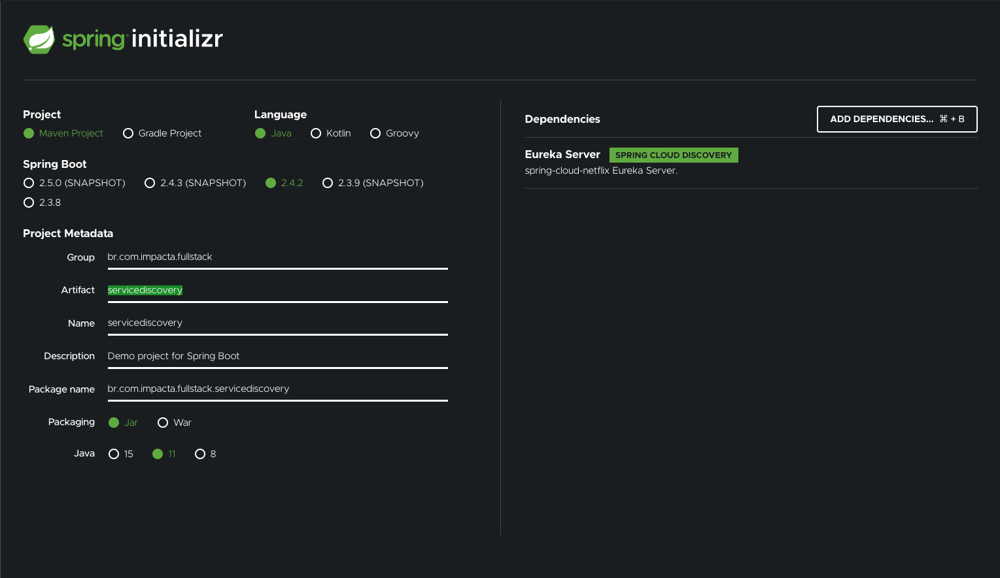

# Microservices com Spring Boot

Neste repositório estarão disponíveis nosso *Workshop* de implementação de **Microservices** com [Spring Boot](https://spring.io/projects/spring-boot)

## Pré Requisitos

- [JDK/Open JDK 11 (no mínimo)](https://openjdk.java.net/install/)
- [Apache Maven 3.6.x](https://maven.apache.org/download.cgi)
- [IntelliJ Community](https://www.jetbrains.com/idea/download/#section=mac)
- [Docker Desktop Win/Mac 3.x](https://www.docker.com/products/docker-desktop)

## Workshop

0. [Criação Credito API](#workshop-criacao-credito-api)
1. [Criação Debito API](#workshop-criacao-debito-api)
2. [Criação SaldoExtrato API](#workshop-criacao-saldoextrato-api)
3. [Criação SaldoExtrato BFF API](#workshop-criacao-saldoextrato-bff-api)
4. [Criação Config Server](#workshop-criacao-config-server)
5. [Criação Service Discovery Server](#workshop-service-discovery-server)

## Implementação

### 0 - Criação Credito API <a name="workshop-criacao-credito-api">

* Acesse o [Spring Boot Initializer](https://start.spring.io/) e gere um projeto com as seguintes informações:

  ```
  Project: Maven
  Language: Java
  Spring Boot: 2.4.2
  Project Metadata
    Group: br.com.impacta.fullstack
    artifact: credito
    name: credito
    Package Name: br.com.impacta.fullstack.credito
    Packaging: jar
    Java: 11
  Dependencies:
    Spring Web
  ```

  

* Importe o projeto no *IntelliJ* e verifique se o mesmo está sendo executado com sucesso através do comando *mvn spring:boot run*:

  ```
  ~/Documents/IMPACTA/2021/FullStack/MicroservicesServeless/MicroServicesWithSpringBoot/source/crebito-api-v1/credito(master*) » mvn spring-boot:run
  [INFO] Scanning for projects...
  [INFO]
  [INFO] ------------------< br.com.impacta.fullstack:credito >------------------
  [INFO] Building credito 0.0.1-SNAPSHOT
  [INFO] --------------------------------[ jar ]---------------------------------
  [INFO]
  [INFO] >>> spring-boot-maven-plugin:2.4.2:run (default-cli) > test-compile @ credito >>>
  [INFO]
  [INFO] --- maven-resources-plugin:3.2.0:resources (default-resources) @ credito ---
  [INFO] Using 'UTF-8' encoding to copy filtered resources.
  [INFO] Using 'UTF-8' encoding to copy filtered properties files.
  [INFO] Copying 1 resource
  [INFO] Copying 0 resource
  [INFO]
  [INFO] --- maven-compiler-plugin:3.8.1:compile (default-compile) @ credito ---
  [INFO] Changes detected - recompiling the module!
  [INFO] Compiling 1 source file to /Users/vinny/Documents/IMPACTA/2021/FullStack/MicroservicesServeless/MicroServicesWithSpringBoot/source/crebito-api-v1/credito/target/classes
  [INFO]
  [INFO] --- maven-resources-plugin:3.2.0:testResources (default-testResources) @ credito ---
  [INFO] Using 'UTF-8' encoding to copy filtered resources.
  [INFO] Using 'UTF-8' encoding to copy filtered properties files.
  [INFO] skip non existing resourceDirectory /Users/vinny/Documents/IMPACTA/2021/FullStack/MicroservicesServeless/MicroServicesWithSpringBoot/source/crebito-api-v1/credito/src/test/resources
  [INFO]
  [INFO] --- maven-compiler-plugin:3.8.1:testCompile (default-testCompile) @ credito ---
  [INFO] Changes detected - recompiling the module!
  [INFO] Compiling 1 source file to /Users/vinny/Documents/IMPACTA/2021/FullStack/MicroservicesServeless/MicroServicesWithSpringBoot/source/crebito-api-v1/credito/target/test-classes
  [INFO]
  [INFO] <<< spring-boot-maven-plugin:2.4.2:run (default-cli) < test-compile @ credito <<<
  [INFO]
  [INFO]
  [INFO] --- spring-boot-maven-plugin:2.4.2:run (default-cli) @ credito ---
  [INFO] Attaching agents: []
  OpenJDK 64-Bit Server VM warning: forcing TieredStopAtLevel to full optimization because JVMCI is enabled

    .   ____          _            __ _ _
   /\\ / ___'_ __ _ _(_)_ __  __ _ \ \ \ \
  ( ( )\___ | '_ | '_| | '_ \/ _` | \ \ \ \
   \\/  ___)| |_)| | | | | || (_| |  ) ) ) )
    '  |____| .__|_| |_|_| |_\__, | / / / /
   =========|_|==============|___/=/_/_/_/
   :: Spring Boot ::                (v2.4.2)

  2021-01-18 11:34:01.227  INFO 16857 --- [           main] b.c.i.f.credito.CreditoApplication       : Starting CreditoApplication using Java 11.0.7 on marcfleury with PID 16857 (/Users/vinny/Documents/IMPACTA/2021/FullStack/MicroservicesServeless/MicroServicesWithSpringBoot/source/crebito-api-v1/credito/target/classes started by vinny in /Users/vinny/Documents/IMPACTA/2021/FullStack/MicroservicesServeless/MicroServicesWithSpringBoot/source/crebito-api-v1/credito)
  2021-01-18 11:34:01.230  INFO 16857 --- [           main] b.c.i.f.credito.CreditoApplication       : No active profile set, falling back to default profiles: default
  2021-01-18 11:34:02.147  INFO 16857 --- [           main] o.s.b.w.embedded.tomcat.TomcatWebServer  : Tomcat initialized with port(s): 8080 (http)
  2021-01-18 11:34:02.157  INFO 16857 --- [           main] o.apache.catalina.core.StandardService   : Starting service [Tomcat]
  2021-01-18 11:34:02.157  INFO 16857 --- [           main] org.apache.catalina.core.StandardEngine  : Starting Servlet engine: [Apache Tomcat/9.0.41]
  2021-01-18 11:34:02.217  INFO 16857 --- [           main] o.a.c.c.C.[Tomcat].[localhost].[/]       : Initializing Spring embedded WebApplicationContext
  2021-01-18 11:34:02.217  INFO 16857 --- [           main] w.s.c.ServletWebServerApplicationContext : Root WebApplicationContext: initialization completed in 935 ms
  2021-01-18 11:34:02.385  INFO 16857 --- [           main] o.s.s.concurrent.ThreadPoolTaskExecutor  : Initializing ExecutorService 'applicationTaskExecutor'
  2021-01-18 11:34:02.561  INFO 16857 --- [           main] o.s.b.w.embedded.tomcat.TomcatWebServer  : Tomcat started on port(s): 8080 (http) with context path ''
  2021-01-18 11:34:02.570  INFO 16857 --- [           main] b.c.i.f.credito.CreditoApplication       : Started CreditoApplication in 1.814 seconds (JVM running for 2.151)
  ```
    * o *output* deve variar variar ligeiramente do apresentando anteriormente observando as características do seu ambiente

  

* Criar classe **br.com.impacta.fullstack.credito.Credito**

  ```
  package br.com.impacta.fullstack.credito;

  import java.io.Serializable;
  import java.math.BigDecimal;

  public class Credito implements Serializable {

      private BigDecimal credito;

      public Credito() {
          super();
      }

      public Credito(BigDecimal credito){
          this.credito = credito;
      }

      public BigDecimal getCredito() {
          return credito;
      }

      public void setCredito(BigDecimal credito) {
          this.credito = credito;
      }

  }
  ```

* Criar classe **br.com.impacta.fullstack.credito.CreditoService**

  ```
  package br.com.impacta.fullstack.credito;

  import org.springframework.stereotype.Component;

  import java.math.BigDecimal;
  import java.math.BigInteger;
  import java.util.ArrayList;
  import java.util.List;
  import java.util.Random;

  @Component
  public class CreditoService {

      private static final BigDecimal minValue = new BigDecimal(BigInteger.ONE);
      private static final BigDecimal maxValue = new BigDecimal(BigInteger.TEN);

      public List<Credito> list(){
          int numberOfCredit = new Random().nextInt(10) + 1;
          List<Credito> creditoList = new ArrayList<Credito>(10);
          for (int i = 0; i < numberOfCredit; i++) {
              BigDecimal randomValue = minValue.add(new BigDecimal(Math.random()).multiply(maxValue.subtract(minValue))).setScale(1, BigDecimal.ROUND_HALF_UP);
              Credito credito = new Credito(randomValue);
              creditoList.add(credito);
          }
          System.out.println("creditoList: " + creditoList);
          return creditoList;
      }
  }
  ```

* Criar classe **br.com.impacta.fullstack.credito.CreditoController**

  ```
  package br.com.impacta.fullstack.credito;

  import org.springframework.web.bind.annotation.GetMapping;
  import org.springframework.web.bind.annotation.RequestMapping;
  import org.springframework.web.bind.annotation.RestController;

  import java.net.InetAddress;
  import java.net.UnknownHostException;
  import java.util.List;

  @RestController
  @RequestMapping("/api/v1/credito")
  public class CreditoController {

      private final CreditoService creditoService;

      public CreditoController(CreditoService creditoService) {
          this.creditoService = creditoService;
      }

      @GetMapping
      public List<Credito> list() throws UnknownHostException {
          System.out.println("Hostname: " + InetAddress.getLocalHost().getHostName());
          List<Credito> creditoList = creditoService.list();
          return creditoList;
      }

  }
  ```

* Ajustes na configuração de porta para evitar conflitos no arquivo **src/main/resources/application.properties**:

  ```
  server.port = 8081
  ```

* Para testar basta inicializar o serviço e invocar a *API* através de seu endpoint:

  ```
  mvn spring:boot run

  -- outra aba do terminal/postman/httpie/curl/etc
  http :8081/api/v1/credito
  ```

  

### 1 - Criação Débito API <a name="workshop-criacao-debito-api">

  * Acesse o [Spring Boot Initializer](https://start.spring.io/) e gere um projeto com as seguintes informações:

    ```
    Project: Maven
    Language: Java
    Spring Boot: 2.4.2
    Project Metadata
      Group: br.com.impacta.fullstack
      artifact: debito
      name: debito
      Package Name: br.com.impacta.fullstack.debito
      Packaging: jar
      Java: 11
    Dependencies:
      Spring Web
    ```

    

  * Importe o projeto no *IntelliJ* e verifique se o mesmo está sendo executado com sucesso através do comando *mvn spring:boot run*:

    ```
    ~/Documents/IMPACTA/2021/FullStack/MicroservicesServeless/MicroServicesWithSpringBoot/source/debito-api-v1/debito(master*) » mvn spring-boot:run      vinny@marcfleury
    [INFO] Scanning for projects...
    [INFO]
    [INFO] ------------------< br.com.impacta.fullstack:debito >-------------------
    [INFO] Building debito 0.0.1-SNAPSHOT
    [INFO] --------------------------------[ jar ]---------------------------------
    [INFO]
    [INFO] >>> spring-boot-maven-plugin:2.4.2:run (default-cli) > test-compile @ debito >>>
    [INFO]
    [INFO] --- maven-resources-plugin:3.2.0:resources (default-resources) @ debito ---
    [INFO] Using 'UTF-8' encoding to copy filtered resources.
    [INFO] Using 'UTF-8' encoding to copy filtered properties files.
    [INFO] Copying 1 resource
    [INFO] Copying 0 resource
    [INFO]
    [INFO] --- maven-compiler-plugin:3.8.1:compile (default-compile) @ debito ---
    [INFO] Changes detected - recompiling the module!
    [INFO] Compiling 1 source file to /Users/vinny/Documents/IMPACTA/2021/FullStack/MicroservicesServeless/MicroServicesWithSpringBoot/source/debito-api-v1/debito/target/classes
    [INFO]
    [INFO] --- maven-resources-plugin:3.2.0:testResources (default-testResources) @ debito ---
    [INFO] Using 'UTF-8' encoding to copy filtered resources.
    [INFO] Using 'UTF-8' encoding to copy filtered properties files.
    [INFO] skip non existing resourceDirectory /Users/vinny/Documents/IMPACTA/2021/FullStack/MicroservicesServeless/MicroServicesWithSpringBoot/source/debito-api-v1/debito/src/test/resources
    [INFO]
    [INFO] --- maven-compiler-plugin:3.8.1:testCompile (default-testCompile) @ debito ---
    [INFO] Changes detected - recompiling the module!
    [INFO] Compiling 1 source file to /Users/vinny/Documents/IMPACTA/2021/FullStack/MicroservicesServeless/MicroServicesWithSpringBoot/source/debito-api-v1/debito/target/test-classes
    [INFO]
    [INFO] <<< spring-boot-maven-plugin:2.4.2:run (default-cli) < test-compile @ debito <<<
    [INFO]
    [INFO]
    [INFO] --- spring-boot-maven-plugin:2.4.2:run (default-cli) @ debito ---
    [INFO] Attaching agents: []
    OpenJDK 64-Bit Server VM warning: forcing TieredStopAtLevel to full optimization because JVMCI is enabled

      .   ____          _            __ _ _
     /\\ / ___'_ __ _ _(_)_ __  __ _ \ \ \ \
    ( ( )\___ | '_ | '_| | '_ \/ _` | \ \ \ \
     \\/  ___)| |_)| | | | | || (_| |  ) ) ) )
      '  |____| .__|_| |_|_| |_\__, | / / / /
     =========|_|==============|___/=/_/_/_/
     :: Spring Boot ::                (v2.4.2)

    2021-01-18 16:11:10.623  INFO 28751 --- [           main] b.c.i.f.debito.DebitoApplication         : Starting DebitoApplication using Java 11.0.7 on marcfleury with PID 28751 (/Users/vinny/Documents/IMPACTA/2021/FullStack/MicroservicesServeless/MicroServicesWithSpringBoot/source/debito-api-v1/debito/target/classes started by vinny in /Users/vinny/Documents/IMPACTA/2021/FullStack/MicroservicesServeless/MicroServicesWithSpringBoot/source/debito-api-v1/debito)
    2021-01-18 16:11:10.628  INFO 28751 --- [           main] b.c.i.f.debito.DebitoApplication         : No active profile set, falling back to default profiles: default
    2021-01-18 16:11:11.520  INFO 28751 --- [           main] o.s.b.w.embedded.tomcat.TomcatWebServer  : Tomcat initialized with port(s): 8080 (http)
    2021-01-18 16:11:11.534  INFO 28751 --- [           main] o.apache.catalina.core.StandardService   : Starting service [Tomcat]
    2021-01-18 16:11:11.534  INFO 28751 --- [           main] org.apache.catalina.core.StandardEngine  : Starting Servlet engine: [Apache Tomcat/9.0.41]
    2021-01-18 16:11:11.597  INFO 28751 --- [           main] o.a.c.c.C.[Tomcat].[localhost].[/]       : Initializing Spring embedded WebApplicationContext
    2021-01-18 16:11:11.597  INFO 28751 --- [           main] w.s.c.ServletWebServerApplicationContext : Root WebApplicationContext: initialization completed in 881 ms
    2021-01-18 16:11:11.753  INFO 28751 --- [           main] o.s.s.concurrent.ThreadPoolTaskExecutor  : Initializing ExecutorService 'applicationTaskExecutor'
    2021-01-18 16:11:11.927  INFO 28751 --- [           main] o.s.b.w.embedded.tomcat.TomcatWebServer  : Tomcat started on port(s): 8080 (http) with context path ''
    2021-01-18 16:11:11.938  INFO 28751 --- [           main] b.c.i.f.debito.DebitoApplication         : Started DebitoApplication in 1.805 seconds (JVM running for 2.221)
    ```
      * o *output* deve variar variar ligeiramente do apresentando anteriormente observando as características do seu ambiente

    

  * Criar classe **br.com.impacta.fullstack.debito.Debito**

    ```
    package br.com.impacta.fullstack.debito;

    import java.io.Serializable;
    import java.math.BigDecimal;

    public class Debito implements Serializable {

        private BigDecimal debito;

        public Debito() {
            super();
        }

        public Debito(BigDecimal debito) {
            this.debito = debito;
        }

        public BigDecimal getDebito() {
            return debito;
        }

        public void setDebito(BigDecimal debito) {
            this.debito = debito;
        }
    }
    ```

  * Criar classe **br.com.impacta.fullstack.debito.DebitoService**

    ```
    package br.com.impacta.fullstack.debito;

    import org.springframework.stereotype.Component;

    import java.math.BigDecimal;
    import java.math.BigInteger;
    import java.util.ArrayList;
    import java.util.List;
    import java.util.Random;

    @Component
    public class DebitoService {

        private static final BigDecimal minValue = new BigDecimal(BigInteger.ONE);
        private static final BigDecimal maxValue = new BigDecimal(BigInteger.TEN);

        public List<Debito> list(){
            int numberOfDebit = new Random().nextInt(10) + 1;
            List<Debito> debitoList = new ArrayList<Debito>(10);
            for (int i = 0; i < numberOfDebit; i++) {
                BigDecimal randomValue = minValue.add(new BigDecimal(Math.random()).multiply(maxValue.subtract(minValue))).setScale(1, BigDecimal.ROUND_HALF_UP).multiply(new BigDecimal("-1"));
                Debito debito = new Debito(randomValue);
                debitoList.add(debito);
            }
            System.out.println("debitoList: " + debitoList);
            return debitoList;
        }
    }
    ```

  * Criar classe **br.com.impacta.fullstack.debito.DebitoController**

    ```
    package br.com.impacta.fullstack.debito;

    import org.springframework.web.bind.annotation.GetMapping;
    import org.springframework.web.bind.annotation.RequestMapping;
    import org.springframework.web.bind.annotation.RestController;

    import java.net.InetAddress;
    import java.net.UnknownHostException;
    import java.util.List;

    @RestController
    @RequestMapping("/api/v1/debito")
    public class DebitoController {

        private final DebitoService debitoService;

        public DebitoController(DebitoService debitoService) {
            this.debitoService = debitoService;
        }

        @GetMapping
        public List<Debito> list() throws UnknownHostException {
            System.out.println("Hostname: " + InetAddress.getLocalHost().getHostName());
            List<Debito> debitoList = debitoService.list();
            return debitoList;
        }
    }
    ```

  * Ajustes na configuração de porta para evitar conflitos no arquivo **src/main/resources/application.properties**:

    ```
    server.port = 8082
    ```

  * Para testar basta inicializar o serviço e invocar a *API* através de seu endpoint:

    ```
    mvn spring:boot run

    -- outra aba do terminal/postman/httpie/curl/etc
    http :8082/api/v1/debito
    ```

    

### 2 - Criação SaldoExtrato API <a name="workshop-criacao-saldoextrato-api">

* Acesse o [Spring Boot Initializer](https://start.spring.io/) e gere um projeto com as seguintes informações:

  ```
  Project: Maven
  Language: Java
  Spring Boot: 2.4.2
  Project Metadata
    Group: br.com.impacta.fullstack
    artifact: saldoextrato
    name: saldoextrato
    Package Name: br.com.impacta.fullstack.saldoextrato
    Packaging: jar
    Java: 11
  Dependencies:
    Spring Web
  ```

  

* Importe o projeto no *IntelliJ* e verifique se o mesmo está sendo executado com sucesso através do comando *mvn spring:boot run*:

  ```
  ~/Documents/IMPACTA/2021/FullStack/MicroservicesServeless/MicroServicesWithSpringBoot/source/saldoextrato-api-v1/saldoextrato(master*) » mvn spring-boot:run
  [INFO] Scanning for projects...
  [INFO]
  [INFO] ---------------< br.com.impacta.fullstack:saldoextrato >----------------
  [INFO] Building saldoextrato 0.0.1-SNAPSHOT
  [INFO] --------------------------------[ jar ]---------------------------------
  [INFO]
  [INFO] >>> spring-boot-maven-plugin:2.4.2:run (default-cli) > test-compile @ saldoextrato >>>
  [INFO]
  [INFO] --- maven-resources-plugin:3.2.0:resources (default-resources) @ saldoextrato ---
  [INFO] Using 'UTF-8' encoding to copy filtered resources.
  [INFO] Using 'UTF-8' encoding to copy filtered properties files.
  [INFO] Copying 1 resource
  [INFO] Copying 0 resource
  [INFO]
  [INFO] --- maven-compiler-plugin:3.8.1:compile (default-compile) @ saldoextrato ---
  [INFO] Changes detected - recompiling the module!
  [INFO] Compiling 1 source file to /Users/vinny/Documents/IMPACTA/2021/FullStack/MicroservicesServeless/MicroServicesWithSpringBoot/source/saldoextrato-api-v1/saldoextrato/target/classes
  [INFO]
  [INFO] --- maven-resources-plugin:3.2.0:testResources (default-testResources) @ saldoextrato ---
  [INFO] Using 'UTF-8' encoding to copy filtered resources.
  [INFO] Using 'UTF-8' encoding to copy filtered properties files.
  [INFO] skip non existing resourceDirectory /Users/vinny/Documents/IMPACTA/2021/FullStack/MicroservicesServeless/MicroServicesWithSpringBoot/source/saldoextrato-api-v1/saldoextrato/src/test/resources
  [INFO]
  [INFO] --- maven-compiler-plugin:3.8.1:testCompile (default-testCompile) @ saldoextrato ---
  [INFO] Changes detected - recompiling the module!
  [INFO] Compiling 1 source file to /Users/vinny/Documents/IMPACTA/2021/FullStack/MicroservicesServeless/MicroServicesWithSpringBoot/source/saldoextrato-api-v1/saldoextrato/target/test-classes
  [INFO]
  [INFO] <<< spring-boot-maven-plugin:2.4.2:run (default-cli) < test-compile @ saldoextrato <<<
  [INFO]
  [INFO]
  [INFO] --- spring-boot-maven-plugin:2.4.2:run (default-cli) @ saldoextrato ---
  [INFO] Attaching agents: []
  OpenJDK 64-Bit Server VM warning: forcing TieredStopAtLevel to full optimization because JVMCI is enabled

    .   ____          _            __ _ _
   /\\ / ___'_ __ _ _(_)_ __  __ _ \ \ \ \
  ( ( )\___ | '_ | '_| | '_ \/ _` | \ \ \ \
   \\/  ___)| |_)| | | | | || (_| |  ) ) ) )
    '  |____| .__|_| |_|_| |_\__, | / / / /
   =========|_|==============|___/=/_/_/_/
   :: Spring Boot ::                (v2.4.2)

  2021-01-19 08:51:55.947  INFO 35084 --- [           main] b.c.i.f.s.SaldoextratoApplication        : Starting SaldoextratoApplication using Java 11.0.7 on marcfleury with PID 35084 (/Users/vinny/Documents/IMPACTA/2021/FullStack/MicroservicesServeless/MicroServicesWithSpringBoot/source/saldoextrato-api-v1/saldoextrato/target/classes started by vinny in /Users/vinny/Documents/IMPACTA/2021/FullStack/MicroservicesServeless/MicroServicesWithSpringBoot/source/saldoextrato-api-v1/saldoextrato)
  2021-01-19 08:51:55.948  INFO 35084 --- [           main] b.c.i.f.s.SaldoextratoApplication        : No active profile set, falling back to default profiles: default
  2021-01-19 08:51:56.753  INFO 35084 --- [           main] o.s.b.w.embedded.tomcat.TomcatWebServer  : Tomcat initialized with port(s): 8080 (http)
  2021-01-19 08:51:56.763  INFO 35084 --- [           main] o.apache.catalina.core.StandardService   : Starting service [Tomcat]
  2021-01-19 08:51:56.763  INFO 35084 --- [           main] org.apache.catalina.core.StandardEngine  : Starting Servlet engine: [Apache Tomcat/9.0.41]
  2021-01-19 08:51:56.819  INFO 35084 --- [           main] o.a.c.c.C.[Tomcat].[localhost].[/]       : Initializing Spring embedded WebApplicationContext
  2021-01-19 08:51:56.820  INFO 35084 --- [           main] w.s.c.ServletWebServerApplicationContext : Root WebApplicationContext: initialization completed in 831 ms
  2021-01-19 08:51:56.968  INFO 35084 --- [           main] o.s.s.concurrent.ThreadPoolTaskExecutor  : Initializing ExecutorService 'applicationTaskExecutor'
  2021-01-19 08:51:57.141  INFO 35084 --- [           main] o.s.b.w.embedded.tomcat.TomcatWebServer  : Tomcat started on port(s): 8080 (http) with context path ''
  2021-01-19 08:51:57.151  INFO 35084 --- [           main] b.c.i.f.s.SaldoextratoApplication        : Started SaldoextratoApplication in 1.673 seconds (JVM running for 2.029)
  ```
  * o *output* deve variar variar ligeiramente do apresentando anteriormente observando as características do seu ambiente

  

* Criar classe **br.com.impacta.fullstack.saldoextrato.Credito**

  ```
  package br.com.impacta.fullstack.saldoextrato;

  import java.io.Serializable;
  import java.math.BigDecimal;

  public class Credito implements Serializable {

      private BigDecimal credito;

      public Credito() {}

      public Credito(BigDecimal credito) {
          this.credito = credito;
      }

      public BigDecimal getCredito() {
          return credito;
      }

      public void setCredito(BigDecimal credito) {
          this.credito = credito;
      }

  }
  ```

* Criar classe **br.com.impacta.fullstack.saldoextrato.Debito**

  ```
  package br.com.impacta.fullstack.saldoextrato;

  import java.io.Serializable;
  import java.math.BigDecimal;

  public class Debito implements Serializable {

      private BigDecimal debito;

      public Debito() {}

      public Debito(BigDecimal debito) {
          this.debito = debito;
      }

      public BigDecimal getDebito() {
          return debito;
      }

      public void setDebito(BigDecimal debito) {
          this.debito = debito;
      }

  }
  ```

* Criar classe **br.com.impacta.fullstack.saldoextrato.SaldoExtrato**

  ```
  package br.com.impacta.fullstack.saldoextrato;

  import java.math.BigDecimal;
  import java.util.List;

  public class SaldoExtrato {

      private List<Credito> creditoList;
      private List<Debito> debitoList;
      private BigDecimal saldo;

      public List<Debito> getDebitoList() {
          return debitoList;
      }

      public void setDebitoList(List<Debito> debitoList) {
          this.debitoList = debitoList;
      }

      public List<Credito> getCreditoList() {
          return creditoList;
      }

      public void setCreditoList(List<Credito> creditoList) {
          this.creditoList = creditoList;
      }

      public BigDecimal getSaldo() {
          return saldo;
      }

      public void setSaldo(BigDecimal saldo) {
          this.saldo = saldo;
      }

  }
  ```

* Criar classe **br.com.impacta.fullstack.saldoextrato.SaldoExtratoService**

  ```
  package br.com.impacta.fullstack.saldoextrato;

  import org.springframework.beans.factory.annotation.Value;
  import org.springframework.http.ResponseEntity;
  import org.springframework.stereotype.Component;
  import org.springframework.web.client.RestTemplate;

  import java.math.BigDecimal;
  import java.util.Arrays;
  import java.util.List;

  @Component
  public class SaldoExtratoService {

      @Value(value = "${CREDITO_API_URL}")
      private String CREDITO_API_URL;

      @Value(value = "${DEBITO_API_URL}")
      private String DEBITO_API_URL;

      public SaldoExtrato get(){
          RestTemplate restTemplate = new RestTemplate();
          //Get Credito
          ResponseEntity<Credito[]> creditoResponse = restTemplate.getForEntity(CREDITO_API_URL, Credito[].class);
          System.out.println("CREDITO_API_URL: " + CREDITO_API_URL);
          List<Credito> creditoList = Arrays.asList(creditoResponse.getBody());
          System.out.println("Creditos: " + creditoList);
          SaldoExtrato saldoExtrato = new SaldoExtrato();
          saldoExtrato.setCreditoList(creditoList);
          BigDecimal creditoSum = creditoList.stream().map(Credito::getCredito).reduce(BigDecimal.ZERO, BigDecimal::add);
          //Get Debito
          ResponseEntity<Debito[]> debitoResponse = restTemplate.getForEntity(DEBITO_API_URL, Debito[].class);
          System.out.println("DEBITO_API_URL: " + DEBITO_API_URL);
          List<Debito> debitoList = Arrays.asList(debitoResponse.getBody());
          System.out.println("Debitos: " + debitoList);
          saldoExtrato.setDebitoList(debitoList);
          BigDecimal debitoSum = debitoList.stream().map(Debito::getDebito).reduce(BigDecimal.ZERO, BigDecimal::add);
          System.out.println("debitoSum: " + debitoSum);
          //Calcular saldo
          BigDecimal saldo = creditoSum.add(debitoSum);
          saldoExtrato.setSaldo(saldo);
          return saldoExtrato;
      }
  }
  ```

* Criar classe **br.com.impacta.fullstack.saldoextrato.SaldoExtratoController**

  ```
  package br.com.impacta.fullstack.saldoextrato;

  import org.springframework.web.bind.annotation.GetMapping;
  import org.springframework.web.bind.annotation.RequestMapping;
  import org.springframework.web.bind.annotation.RestController;

  import java.net.InetAddress;
  import java.net.UnknownHostException;

  @RestController
  @RequestMapping(("/api/v1/saldoextrato"))
  public class SaldoExtratoController {

      private final SaldoExtratoService saldoExtratoService;

      public SaldoExtratoController(SaldoExtratoService saldoExtratoService) {
          this.saldoExtratoService = saldoExtratoService;
      }

      @GetMapping
      public SaldoExtrato get() throws UnknownHostException {
          System.out.println("Hostname: " + InetAddress.getLocalHost().getHostName());
          SaldoExtrato saldoExtrato = saldoExtratoService.get();
          return saldoExtrato;
      }

  }
  ```

* Ajustes na configuração de porta no arquivo **src/main/resources/application.properties**:

  ```
  CREDITO_API_URL = ${CREDITO_URL:http://localhost:8081/api/v1/credito}
  DEBITO_API_URL = ${DEBITO_URL:http://localhost:8082/api/v1/debito}
  ```

* Para testar basta inicializar o serviço e invocar a *API* através de seu endpoint:

  ```
  mvn spring:boot run

  -- outra aba do terminal/postman/httpie/curl/etc
  http :8080/api/v1/saldoextrato
  ```

  

### 3 - Criação SaldoExtrato BFF API <a name="workshop-criacao-saldoextrato-bff-api">

* Editar a classe **br.com.impacta.fullstack.saldoextrato.SaldoExtratoService** adicionando os métodos **getBff()** e **calculateSaldo**

  ```
  package br.com.impacta.fullstack.saldoextrato;

  import org.springframework.beans.factory.annotation.Value;
  import org.springframework.http.ResponseEntity;
  import org.springframework.stereotype.Component;
  import org.springframework.web.client.RestTemplate;

  import java.math.BigDecimal;
  import java.util.Arrays;
  import java.util.List;

  @Component
  public class SaldoExtratoService {

      @Value(value = "${CREDITO_API_URL}")
      private String CREDITO_API_URL;

      @Value(value = "${DEBITO_API_URL}")
      private String DEBITO_API_URL;

      public SaldoExtrato get(){
          RestTemplate restTemplate = new RestTemplate();
          //Get Credito
          ResponseEntity<Credito[]> creditoResponse = restTemplate.getForEntity(CREDITO_API_URL, Credito[].class);
          System.out.println("CREDITO_API_URL: " + CREDITO_API_URL);
          List<Credito> creditoList = Arrays.asList(creditoResponse.getBody());
          System.out.println("Creditos: " + creditoList);
          SaldoExtrato saldoExtrato = new SaldoExtrato();
          saldoExtrato.setCreditoList(creditoList);
          //Get Debito
          ResponseEntity<Debito[]> debitoResponse = restTemplate.getForEntity(DEBITO_API_URL, Debito[].class);
          System.out.println("DEBITO_API_URL: " + DEBITO_API_URL);
          List<Debito> debitoList = Arrays.asList(debitoResponse.getBody());
          System.out.println("Debitos: " + debitoList);
          saldoExtrato.setDebitoList(debitoList);
          //Calcular saldo
          BigDecimal saldo = calculateSaldo(creditoList, debitoList);
          saldoExtrato.setSaldo(saldo);
          System.out.println("saldo: " + saldo);
          return saldoExtrato;
      }

      public SaldoExtrato getBff(){
          RestTemplate restTemplate = new RestTemplate();
          //Get Credito
          ResponseEntity<Credito[]> creditoResponse = restTemplate.getForEntity(CREDITO_API_URL, Credito[].class);
          System.out.println("CREDITO_API_URL: " + CREDITO_API_URL);
          List<Credito> creditoList = Arrays.asList(creditoResponse.getBody());
          System.out.println("Creditos: " + creditoList);
          //Get Debito
          ResponseEntity<Debito[]> debitoResponse = restTemplate.getForEntity(DEBITO_API_URL, Debito[].class);
          System.out.println("DEBITO_API_URL: " + DEBITO_API_URL);
          List<Debito> debitoList = Arrays.asList(debitoResponse.getBody());
          System.out.println("Debitos: " + debitoList);
          //Calcular saldo
          SaldoExtrato saldoExtrato = new SaldoExtrato();
          BigDecimal saldo = calculateSaldo(creditoList, debitoList);
          saldoExtrato.setSaldo(saldo);
          System.out.println("saldo: " + saldo);
          return saldoExtrato;
      }

      private BigDecimal calculateSaldo(List<Credito> creditoList, List<Debito> debitoList) {
          BigDecimal creditoSum = creditoList.stream().map(Credito::getCredito).reduce(BigDecimal.ZERO, BigDecimal::add);
          System.out.println("creditoSum: " + creditoSum);
          BigDecimal debitoSum = debitoList.stream().map(Debito::getDebito).reduce(BigDecimal.ZERO, BigDecimal::add);
          System.out.println("debitoSum: " + debitoSum);
          BigDecimal saldo = creditoSum.add(debitoSum);
          System.out.println("saldo: " + saldo);
          return saldo;
      }

  }
  ```

* Editar a classe **br.com.impacta.fullstack.saldoextrato.SaldoExtratoController** adicionando o método **getBff()**

  ```
  @GetMapping
  @RequestMapping("/mobile")
  public SaldoExtrato getBff() throws UnknownHostException {
      System.out.println("Hostname: " + InetAddress.getLocalHost().getHostName());
      SaldoExtrato saldoExtrato = saldoExtratoService.getBff();
      return saldoExtrato;
  }
  ```

* Adicione a propriedade *spring.jackson.default-property-inclusion* com valor *null* no arquivo **application.properties**

  ```
  spring.jackson.default-property-inclusion = non_null
  ```

* Para testar basta inicializar o serviço e invocar a *API* através de seu endpoint:

  ```
  mvn spring:boot run

  -- outra aba do terminal/postman/httpie/curl/etc
  http :8080/api/v1/saldoextrato/mobile
  ```

  

### 4 - Criação Config Server <a name="workshop-criacao-config-server">

* Acesse o [Spring Boot Initializer](https://start.spring.io/) e gere um projeto com as seguintes informações:

  ```
  Project: Maven
  Language: Java
  Spring Boot: 2.4.2
  Project Metadata
    Group: br.com.impacta.fullstack
    artifact: configserver
    name: configserver
    Package Name: br.com.impacta.fullstack.configserver
    Packaging: jar
    Java: 11
  Dependencies:
    Config Server
  ```

  

* Importe o projeto no *IntelliJ* e verifique se o mesmo está sendo executado com sucesso através do comando *mvn spring:boot run*:

  ```
  ~/Documents/IMPACTA/2021/FullStack/MicroservicesServeless/MicroServicesWithSpringBoot/source/config-server-v1/configserver(master*) » mvn spring-boot:run
  [INFO] Scanning for projects...
  [INFO]
  [INFO] ---------------< br.com.impacta.fullstack:configserver >----------------
  [INFO] Building configserver 0.0.1-SNAPSHOT
  [INFO] --------------------------------[ jar ]---------------------------------
  [INFO]
  [INFO] >>> spring-boot-maven-plugin:2.4.2:run (default-cli) > test-compile @ configserver >>>
  [INFO]
  [INFO] --- maven-resources-plugin:3.2.0:resources (default-resources) @ configserver ---
  [INFO] Using 'UTF-8' encoding to copy filtered resources.
  [INFO] Using 'UTF-8' encoding to copy filtered properties files.
  [INFO] Copying 1 resource
  [INFO] Copying 0 resource
  [INFO]
  [INFO] --- maven-compiler-plugin:3.8.1:compile (default-compile) @ configserver ---
  [INFO] Changes detected - recompiling the module!
  [INFO] Compiling 1 source file to /Users/vinny/Documents/IMPACTA/2021/FullStack/MicroservicesServeless/MicroServicesWithSpringBoot/source/config-server-v1/configserver/target/classes
  [INFO]
  [INFO] --- maven-resources-plugin:3.2.0:testResources (default-testResources) @ configserver ---
  [INFO] Using 'UTF-8' encoding to copy filtered resources.
  [INFO] Using 'UTF-8' encoding to copy filtered properties files.
  [INFO] skip non existing resourceDirectory /Users/vinny/Documents/IMPACTA/2021/FullStack/MicroservicesServeless/MicroServicesWithSpringBoot/source/config-server-v1/configserver/src/test/resources
  [INFO]
  [INFO] --- maven-compiler-plugin:3.8.1:testCompile (default-testCompile) @ configserver ---
  [INFO] Changes detected - recompiling the module!
  [INFO] Compiling 1 source file to /Users/vinny/Documents/IMPACTA/2021/FullStack/MicroservicesServeless/MicroServicesWithSpringBoot/source/config-server-v1/configserver/target/test-classes
  [INFO]
  [INFO] <<< spring-boot-maven-plugin:2.4.2:run (default-cli) < test-compile @ configserver <<<
  [INFO]
  [INFO]
  [INFO] --- spring-boot-maven-plugin:2.4.2:run (default-cli) @ configserver ---
  [INFO] Attaching agents: []
  OpenJDK 64-Bit Server VM warning: forcing TieredStopAtLevel to full optimization because JVMCI is enabled

    .   ____          _            __ _ _
   /\\ / ___'_ __ _ _(_)_ __  __ _ \ \ \ \
  ( ( )\___ | '_ | '_| | '_ \/ _` | \ \ \ \
   \\/  ___)| |_)| | | | | || (_| |  ) ) ) )
    '  |____| .__|_| |_|_| |_\__, | / / / /
   =========|_|==============|___/=/_/_/_/
   :: Spring Boot ::                (v2.4.2)

  2021-01-20 09:52:41.732  INFO 2673 --- [           main] b.c.i.f.c.ConfigserverApplication        : Starting ConfigserverApplication using Java 11.0.7 on marcfleury with PID 2673 (/Users/vinny/Documents/IMPACTA/2021/FullStack/MicroservicesServeless/MicroServicesWithSpringBoot/source/config-server-v1/configserver/target/classes started by vinny in /Users/vinny/Documents/IMPACTA/2021/FullStack/MicroservicesServeless/MicroServicesWithSpringBoot/source/config-server-v1/configserver)
  2021-01-20 09:52:41.734  INFO 2673 --- [           main] b.c.i.f.c.ConfigserverApplication        : No active profile set, falling back to default profiles: default
  2021-01-20 09:52:42.930  INFO 2673 --- [           main] o.s.cloud.context.scope.GenericScope     : BeanFactory id=5d126ee3-1e57-37c9-ba7b-c3609c50757a
  2021-01-20 09:52:43.420  INFO 2673 --- [           main] o.s.b.w.embedded.tomcat.TomcatWebServer  : Tomcat initialized with port(s): 8080 (http)
  2021-01-20 09:52:43.430  INFO 2673 --- [           main] o.apache.catalina.core.StandardService   : Starting service [Tomcat]
  2021-01-20 09:52:43.430  INFO 2673 --- [           main] org.apache.catalina.core.StandardEngine  : Starting Servlet engine: [Apache Tomcat/9.0.41]
  2021-01-20 09:52:43.561  INFO 2673 --- [           main] o.a.c.c.C.[Tomcat].[localhost].[/]       : Initializing Spring embedded WebApplicationContext
  2021-01-20 09:52:43.561  INFO 2673 --- [           main] w.s.c.ServletWebServerApplicationContext : Root WebApplicationContext: initialization completed in 1768 ms
  2021-01-20 09:52:43.894  INFO 2673 --- [           main] o.s.s.concurrent.ThreadPoolTaskExecutor  : Initializing ExecutorService 'applicationTaskExecutor'
  2021-01-20 09:52:44.190  INFO 2673 --- [           main] o.s.b.a.e.web.EndpointLinksResolver      : Exposing 2 endpoint(s) beneath base path '/actuator'
  2021-01-20 09:52:44.269  INFO 2673 --- [           main] o.s.b.w.embedded.tomcat.TomcatWebServer  : Tomcat started on port(s): 8080 (http) with context path ''
  2021-01-20 09:52:44.298  INFO 2673 --- [           main] b.c.i.f.c.ConfigserverApplication        : Started ConfigserverApplication in 3.045 seconds (JVM running for 3.429)
  ```

    * o *output* deve variar variar ligeiramente do apresentando anteriormente observando as características do seu ambiente

  

* Inclua a *Annotation @EnableConfigServer* na classe **br.com.impacta.fullstack.configserver.ConfigServerApplication**

  ```
  package br.com.impacta.fullstack.configserver;

  import org.springframework.boot.SpringApplication;
  import org.springframework.boot.autoconfigure.SpringBootApplication;
  import org.springframework.cloud.config.server.EnableConfigServer;

  @EnableConfigServer
  @SpringBootApplication
  public class ConfigServerApplication {

  	public static void main(String[] args) {
  		SpringApplication.run(ConfigServerApplication.class, args);
  	}

  }
  ```

* Altere o arquivo **pom.xml** incluindo as dependências necessárias:

  ```
  <?xml version="1.0" encoding="UTF-8"?>
  <project xmlns="http://maven.apache.org/POM/4.0.0" xmlns:xsi="http://www.w3.org/2001/XMLSchema-instance"
  	xsi:schemaLocation="http://maven.apache.org/POM/4.0.0 https://maven.apache.org/xsd/maven-4.0.0.xsd">
  	<modelVersion>4.0.0</modelVersion>
  	<parent>
  		<groupId>org.springframework.boot</groupId>
  		<artifactId>spring-boot-starter-parent</artifactId>
  		<version>2.4.2</version>
  		<relativePath/> <!-- lookup parent from repository -->
  	</parent>
  	<groupId>br.com.impacta.fullstack</groupId>
  	<artifactId>configserver</artifactId>
  	<version>0.0.1-SNAPSHOT</version>
  	<name>configserver</name>
  	<description>Demo project for Spring Boot</description>
  	<properties>
  		<java.version>11</java.version>
  		<spring-cloud.version>2020.0.0</spring-cloud.version>
  	</properties>

  	<dependencies>
  		<dependency>
  			<groupId>org.springframework.cloud</groupId>
  			<artifactId>spring-cloud-config-server</artifactId>
  		</dependency>
  		<dependency>
  			<groupId>org.springframework.boot</groupId>
  			<artifactId>spring-boot-starter-test</artifactId>
  			<scope>test</scope>
  		</dependency>
  	</dependencies>

  	<dependencyManagement>
  		<dependencies>
  			<dependency>
  				<groupId>org.springframework.cloud</groupId>
  				<artifactId>spring-cloud-dependencies</artifactId>
  				<version>${spring-cloud.version}</version>
  				<type>pom</type>
  				<scope>import</scope>
  			</dependency>
  		</dependencies>
  	</dependencyManagement>

  	<build>
  		<plugins>
  			<plugin>
  				<groupId>org.springframework.boot</groupId>
  				<artifactId>spring-boot-maven-plugin</artifactId>
  			</plugin>
  		</plugins>
  	</build>
  	<repositories>
  		<repository>
  			<id>spring-milestones</id>
  			<name>Spring Milestones</name>
  			<url>https://repo.spring.io/milestone</url>
  		</repository>
  	</repositories>

  </project>
  ```

* Por fim altere o arquivo **application.properties** adicionando o seguinte conteúdo:

  ```
  server.port=8888
  spring.application.name=configserver
  spring.cloud.config.server.git.uri=https://github.com/vinicius-martinez/FsConfigServer
  ```

* No projeto **SaldoExtrato** modique o arquivo **pom.xml** adicionando as dependências para utilização do *Config Server*:

  ```
  <?xml version="1.0" encoding="UTF-8"?>
  <project xmlns="http://maven.apache.org/POM/4.0.0" xmlns:xsi="http://www.w3.org/2001/XMLSchema-instance"
  	xsi:schemaLocation="http://maven.apache.org/POM/4.0.0 https://maven.apache.org/xsd/maven-4.0.0.xsd">
  	<modelVersion>4.0.0</modelVersion>
  	<parent>
  		<groupId>org.springframework.boot</groupId>
  		<artifactId>spring-boot-starter-parent</artifactId>
  		<version>2.4.2</version>
  		<relativePath/>
  	</parent>
  	<groupId>br.com.impacta.fullstack</groupId>
  	<artifactId>saldoextrato</artifactId>
  	<version>0.0.3-SNAPSHOT</version>
  	<name>saldoextrato</name>
  	<description>Demo project for Spring Boot</description>

  	<properties>
  		<java.version>11</java.version>
  		<spring.cloud-version>2020.0.0</spring.cloud-version>
  	</properties>

  	<dependencies>
  		<dependency>
  			<groupId>org.springframework.boot</groupId>
  			<artifactId>spring-boot-starter-web</artifactId>
  		</dependency>
  		<dependency>
  			<groupId>org.springframework.cloud</groupId>
  			<artifactId>spring-cloud-starter-config</artifactId>
  		</dependency>
  		<dependency>
  			<groupId>org.springframework.cloud</groupId>
  			<artifactId>spring-cloud-starter-bootstrap</artifactId>
  		</dependency>
  		<dependency>
  			<groupId>org.springframework.boot</groupId>
  			<artifactId>spring-boot-starter-test</artifactId>
  			<scope>test</scope>
  		</dependency>
  	</dependencies>

  	<dependencyManagement>
  		<dependencies>
  			<dependency>
  				<groupId>org.springframework.cloud</groupId>
  				<artifactId>spring-cloud-dependencies</artifactId>
  				<version>${spring.cloud-version}</version>
  				<type>pom</type>
  				<scope>import</scope>
  			</dependency>
  		</dependencies>
  	</dependencyManagement>

  	<build>
  		<plugins>
  			<plugin>
  				<groupId>org.springframework.boot</groupId>
  				<artifactId>spring-boot-maven-plugin</artifactId>
  			</plugin>
  		</plugins>
  	</build>

  </project>
  ```

* Ainda no projeto *SaldoExtrato* crie um arquivo chamado **bootstrap.properties** com o seguinte conteúdo:

  ```
  spring.application.name=saldoextrato
  spring.cloud.config.uri=http://${CONFIG_HOST}:8888
  management.endpoints.web.exposure.include=refresh
  ```


* Para inicializar a aplicação **SaldoExtrato** corretamente, será necessário incluir duas informações adicionais: *host* do *Config Server* e *profile* da aplicação:

  ```
  export spring_profiles_active=dev
  export CONFIG_HOST=localhost

  mvn spring:boot run

  -- outra aba do terminal/postman/httpie/curl/etc
  http :8080/api/v1/saldoextrato/mobile
  http :8080/api/v1/saldoextrato
  ```

### 5 - Criação Service Discovery Server <a name="workshop-service-discovery-server">

* Acesse o [Spring Boot Initializer](https://start.spring.io/) e gere um projeto com as seguintes informações:

  ```
  Project: Maven
  Language: Java
  Spring Boot: 2.4.2
  Project Metadata
    Group: br.com.impacta.fullstack
    artifact: servicediscovery
    name: servicediscovery
    Package Name: br.com.impacta.fullstack.servicediscovery
    Packaging: jar
    Java: 11
  Dependencies:
    Eureka Server
  ```
    

* Altere o arquivo **pom.xml** desse projeto adicionando a dependência *<dependency><groupId>org.glassfish.jaxb</groupId><artifactId>jaxb-runtime</artifactId></dependency>*:

  ```
  <dependency>
		<groupId>org.glassfish.jaxb</groupId>
		<artifactId>jaxb-runtime</artifactId>
	</dependency>
  ```

* Altere a classe **ServiceDiscoveryApplication** adicionando a *EnableEurekaServer:

  ```
  package br.com.impacta.fullstack.servicediscovery;

  import org.springframework.boot.SpringApplication;
  import org.springframework.boot.autoconfigure.SpringBootApplication;
  import org.springframework.cloud.netflix.eureka.server.EnableEurekaServer;

  @SpringBootApplication
  @EnableEurekaServer
  public class ServiceDiscoveryApplication {

  	public static void main(String[] args) {
  		SpringApplication.run(ServiceDiscoveryApplication.class, args);
  	}

  }
  ```

* Altere o arquivo **application.properties** com o seguinte conteúdo:

  ```
  server.port=8761

  eureka.client.register-with-eureka=false
  eureka.client.fetch-registry=false

  logging.level.com.netflix.eureka=OFF
  logging.level.com.netflix.discovery=OFF
  ```

* Modifique o arquivo **pom.xml** projeto **Credito** adicionando o seguinte conteúdo:

  ```
  <?xml version="1.0" encoding="UTF-8"?>
  <project xmlns="http://maven.apache.org/POM/4.0.0" xmlns:xsi="http://www.w3.org/2001/XMLSchema-instance"
  	xsi:schemaLocation="http://maven.apache.org/POM/4.0.0 https://maven.apache.org/xsd/maven-4.0.0.xsd">
  	<modelVersion>4.0.0</modelVersion>
  	<parent>
  		<groupId>org.springframework.boot</groupId>
  		<artifactId>spring-boot-starter-parent</artifactId>
  		<version>2.4.2</version>
  		<relativePath/> <!-- lookup parent from repository -->
  	</parent>
  	<groupId>br.com.impacta.fullstack</groupId>
  	<artifactId>credito</artifactId>
  	<version>0.0.2-SNAPSHOT</version>
  	<name>credito</name>
  	<description>Demo project for Spring Boot</description>

  	<properties>
  		<java.version>11</java.version>
  		<spring-cloud.version>2020.0.0</spring-cloud.version>
  	</properties>

  	<dependencies>
  		<dependency>
  			<groupId>org.springframework.boot</groupId>
  			<artifactId>spring-boot-starter-web</artifactId>
  		</dependency>
  		<dependency>
  			<groupId>org.springframework.cloud</groupId>
  			<artifactId>spring-cloud-starter-netflix-eureka-client</artifactId>
  		</dependency>
  		<dependency>
  			<groupId>org.springframework.boot</groupId>
  			<artifactId>spring-boot-starter-test</artifactId>
  			<scope>test</scope>
  		</dependency>
  	</dependencies>

  	<dependencyManagement>
  		<dependencies>
  			<dependency>
  				<groupId>org.springframework.cloud</groupId>
  				<artifactId>spring-cloud-dependencies</artifactId>
  				<version>${spring-cloud.version}</version>
  				<type>pom</type>
  				<scope>import</scope>
  			</dependency>
  		</dependencies>
  	</dependencyManagement>

  	<build>
  		<plugins>
  			<plugin>
  				<groupId>org.springframework.boot</groupId>
  				<artifactId>spring-boot-maven-plugin</artifactId>
  			</plugin>
  		</plugins>
  	</build>

  </project>
  ```

* Modifique o arquivo **application.properties** projeto **Credito** adicionando o seguinte conteúdo:

  ```
  server.port = 8081
  spring.application.name=credito-v2
  eureka.client.serviceUrl.defaultZone = http://localhost:8761/eureka/
  ```

* Modifique o arquivo **pom.xml** projeto **Debito** adicionando o seguinte conteúdo:

  ```
  <?xml version="1.0" encoding="UTF-8"?>
  <project xmlns="http://maven.apache.org/POM/4.0.0" xmlns:xsi="http://www.w3.org/2001/XMLSchema-instance"
  	xsi:schemaLocation="http://maven.apache.org/POM/4.0.0 https://maven.apache.org/xsd/maven-4.0.0.xsd">
  	<modelVersion>4.0.0</modelVersion>
  	<parent>
  		<groupId>org.springframework.boot</groupId>
  		<artifactId>spring-boot-starter-parent</artifactId>
  		<version>2.4.2</version>
  		<relativePath/> <!-- lookup parent from repository -->
  	</parent>
  	<groupId>br.com.impacta.fullstack</groupId>
  	<artifactId>debito</artifactId>
  	<version>0.0.1-SNAPSHOT</version>
  	<name>debito</name>
  	<description>Demo project for Spring Boot</description>

  	<properties>
  		<java.version>11</java.version>
  		<spring-cloud.version>2020.0.0</spring-cloud.version>
  	</properties>

  	<dependencies>
  		<dependency>
  			<groupId>org.springframework.boot</groupId>
  			<artifactId>spring-boot-starter-web</artifactId>
  		</dependency>
  		<dependency>
  			<groupId>org.springframework.cloud</groupId>
  			<artifactId>spring-cloud-starter-netflix-eureka-client</artifactId>
  		</dependency>
  		<dependency>
  			<groupId>org.springframework.boot</groupId>
  			<artifactId>spring-boot-starter-test</artifactId>
  			<scope>test</scope>
  		</dependency>
  	</dependencies>

  	<dependencyManagement>
  		<dependencies>
  			<dependency>
  				<groupId>org.springframework.cloud</groupId>
  				<artifactId>spring-cloud-dependencies</artifactId>
  				<version>${spring-cloud.version}</version>
  				<type>pom</type>
  				<scope>import</scope>
  			</dependency>
  		</dependencies>
  	</dependencyManagement>

  	<build>
  		<plugins>
  			<plugin>
  				<groupId>org.springframework.boot</groupId>
  				<artifactId>spring-boot-maven-plugin</artifactId>
  			</plugin>
  		</plugins>
  	</build>

  </project>
  ```

* Modifique o arquivo **application.properties** projeto **Credito** adicionando o seguinte conteúdo:

  ```
  server.port = 8082
  spring.application.name=debito-v2
  eureka.client.serviceUrl.defaultZone = http://localhost:8761/eureka/
  ```

* Modifique o arquivo **pom.xml** projeto **SaldoExtrato** adicionando o seguinte conteúdo:

  ```
  <?xml version="1.0" encoding="UTF-8"?>
  <project xmlns="http://maven.apache.org/POM/4.0.0" xmlns:xsi="http://www.w3.org/2001/XMLSchema-instance"
  	xsi:schemaLocation="http://maven.apache.org/POM/4.0.0 https://maven.apache.org/xsd/maven-4.0.0.xsd">
  	<modelVersion>4.0.0</modelVersion>
  	<parent>
  		<groupId>org.springframework.boot</groupId>
  		<artifactId>spring-boot-starter-parent</artifactId>
  		<version>2.4.2</version>
  		<relativePath/>
  	</parent>
  	<groupId>br.com.impacta.fullstack</groupId>
  	<artifactId>saldoextrato</artifactId>
  	<version>0.0.4-SNAPSHOT</version>
  	<name>saldoextrato</name>
  	<description>Demo project for Spring Boot</description>

  	<properties>
  		<java.version>11</java.version>
  		<spring.cloud-version>2020.0.0</spring.cloud-version>
  	</properties>

  	<dependencies>
  		<dependency>
  			<groupId>org.springframework.boot</groupId>
  			<artifactId>spring-boot-starter-web</artifactId>
  		</dependency>
  		<dependency>
  			<groupId>org.springframework.cloud</groupId>
  			<artifactId>spring-cloud-starter-netflix-eureka-client</artifactId>
  		</dependency>
  		<!--
  		<dependency>
  			<groupId>org.springframework.cloud</groupId>
  			<artifactId>spring-cloud-starter-config</artifactId>
  		</dependency>-->
  		<dependency>
  			<groupId>org.springframework.cloud</groupId>
  			<artifactId>spring-cloud-starter-bootstrap</artifactId>
  		</dependency>
  		<dependency>
  			<groupId>org.springframework.boot</groupId>
  			<artifactId>spring-boot-starter-test</artifactId>
  			<scope>test</scope>
  		</dependency>
  	</dependencies>

  	<dependencyManagement>
  		<dependencies>
  			<dependency>
  				<groupId>org.springframework.cloud</groupId>
  				<artifactId>spring-cloud-dependencies</artifactId>
  				<version>${spring.cloud-version}</version>
  				<type>pom</type>
  				<scope>import</scope>
  			</dependency>
  		</dependencies>
  	</dependencyManagement>

  	<build>
  		<plugins>
  			<plugin>
  				<groupId>org.springframework.boot</groupId>
  				<artifactId>spring-boot-maven-plugin</artifactId>
  			</plugin>
  		</plugins>
  	</build>

  </project>
  ```

* Modifique o arquivo **application.properties** projeto **SaldoExtrato** adicionando o seguinte conteúdo:

  ```
  spring.jackson.default-property-inclusion = non_null
  eureka.client.serviceUrl.defaultZone = http://localhost:8761/eureka/
  spring.application.name=saldoextrato
  ```

* Remova/comente o conteúdo do arquivo **bootstrap.properties** no projeto **SaldoExtrato**:

  ```
  #spring.cloud.config.uri=http://${CONFIG_HOST}:8888
  #management.endpoints.web.exposure.include=refresh
  ```

* Altere o conteúdo da classe **br.com.impacta.fullstack.saldoextrato.SaldoExtratoService*** no projeto **SaldoExtrato**:

  ```
  package br.com.impacta.fullstack.saldoextrato;

  import org.springframework.beans.factory.annotation.Autowired;
  import org.springframework.cloud.client.ServiceInstance;
  import org.springframework.cloud.client.discovery.DiscoveryClient;
  import org.springframework.http.ResponseEntity;
  import org.springframework.stereotype.Component;
  import org.springframework.web.client.RestTemplate;

  import java.math.BigDecimal;
  import java.util.Arrays;
  import java.util.List;

  @Component
  public class SaldoExtratoService {

      //@Value("${CREDITO_API_URL}")
      //private String CREDITO_API_URL;

      //@Value("${DEBITO_API_URL}")
      //private String DEBITO_API_URL;

      @Autowired
      private DiscoveryClient discoveryClient;

      public SaldoExtrato get(){
          RestTemplate restTemplate = new RestTemplate();
          //Get Credito
          ServiceInstance serviceInstance = discoveryClient.getInstances("credito-v2").get(0);
          String creditoUrl = "http://" + serviceInstance.getHost() + ":" + serviceInstance.getPort() + "/api/v1/credito";
          ResponseEntity<Credito[]> creditoResponse = restTemplate.getForEntity(creditoUrl, Credito[].class);
          System.out.println("CREDITO_API_URL: " + creditoUrl);
          List<Credito> creditoList = Arrays.asList(creditoResponse.getBody());
          System.out.println("Creditos: " + creditoList);
          SaldoExtrato saldoExtrato = new SaldoExtrato();
          saldoExtrato.setCreditoList(creditoList);
          //Get Debito
          serviceInstance = discoveryClient.getInstances("debito-v2").get(0);
          String debitoUrl = "http://" + serviceInstance.getHost() + ":" + serviceInstance.getPort() + "/api/v1/debito";
          ResponseEntity<Debito[]> debitoResponse = restTemplate.getForEntity(debitoUrl, Debito[].class);
          System.out.println("DEBITO_API_URL: " + debitoUrl);
          List<Debito> debitoList = Arrays.asList(debitoResponse.getBody());
          System.out.println("Debitos: " + debitoList);
          saldoExtrato.setDebitoList(debitoList);
          //Calcular saldo
          BigDecimal saldo = calculateSaldo(creditoList, debitoList);
          saldoExtrato.setSaldo(saldo);
          System.out.println("saldo: " + saldo);
          return saldoExtrato;
      }

      public SaldoExtrato getBff(){
          RestTemplate restTemplate = new RestTemplate();
          //Get Credito
          ServiceInstance serviceInstance = discoveryClient.getInstances("credito-v2").get(0);
          String creditoUrl = "http://" + serviceInstance.getHost() + ":" + serviceInstance.getPort() + "/api/v1/credito";
          ResponseEntity<Credito[]> creditoResponse = restTemplate.getForEntity(creditoUrl, Credito[].class);
          System.out.println("CREDITO_API_URL: " + creditoUrl);
          List<Credito> creditoList = Arrays.asList(creditoResponse.getBody());
          System.out.println("Creditos: " + creditoList);
          //Get Debito
          serviceInstance = discoveryClient.getInstances("debito-v2").get(0);
          String debitoUrl = "http://" + serviceInstance.getHost() + ":" + serviceInstance.getPort() + "/api/v1/debito";
          ResponseEntity<Debito[]> debitoResponse = restTemplate.getForEntity(debitoUrl, Debito[].class);
          System.out.println("DEBITO_API_URL: " + debitoUrl);
          List<Debito> debitoList = Arrays.asList(debitoResponse.getBody());
          System.out.println("Debitos: " + debitoList);
          //Calcular saldo
          SaldoExtrato saldoExtrato = new SaldoExtrato();
          BigDecimal saldo = calculateSaldo(creditoList, debitoList);
          saldoExtrato.setSaldo(saldo);
          System.out.println("saldo: " + saldo);
          return saldoExtrato;
      }

      private BigDecimal calculateSaldo(List<Credito> creditoList, List<Debito> debitoList) {
          BigDecimal creditoSum = creditoList.stream().map(Credito::getCredito).reduce(BigDecimal.ZERO, BigDecimal::add);
          System.out.println("creditoSum: " + creditoSum);
          BigDecimal debitoSum = debitoList.stream().map(Debito::getDebito).reduce(BigDecimal.ZERO, BigDecimal::add);
          System.out.println("debitoSum: " + debitoSum);
          BigDecimal saldo = creditoSum.add(debitoSum);
          System.out.println("saldo: " + saldo);
          return saldo;
      }

  }
  ```
